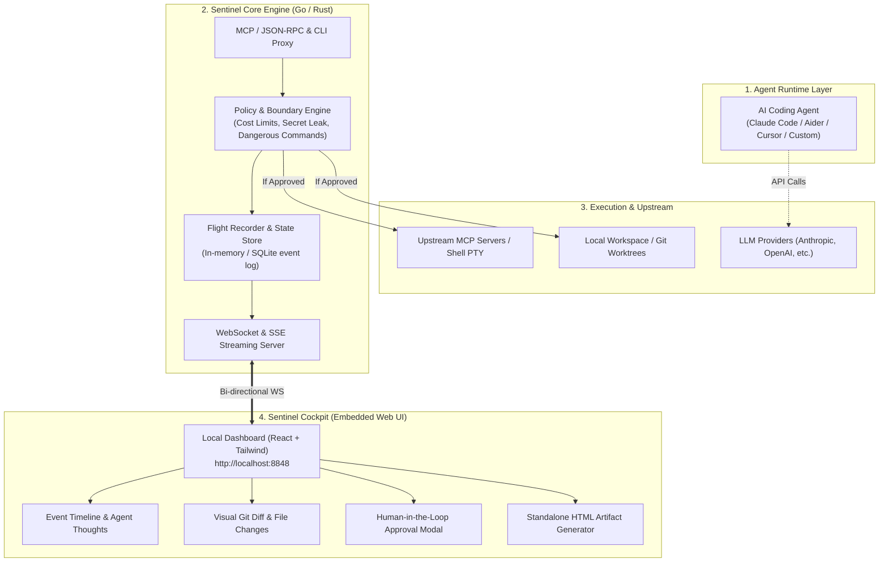
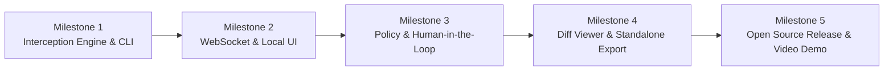

# Agent Sentinel: Architectural Blueprint & Product Specification

> **The Local-First Flight Recorder, Execution Boundary & Cockpit for AI Coding Agents**

> **Stato del documento.** Questa è la specifica di visione scritta all'inizio del progetto; descrive anche cose che oggi non esistono. Per ciò che funziona davvero, vedi il [README](README.md) e [PRODUCT.md](PRODUCT.md). Differenze principali:
> - **Storage:** gli eventi stanno in memoria e sono scritti in un file JSONL per sessione (`~/.sentinel/sessions/`), non in SQLite.
> - **Streaming:** solo WebSocket; non c'è SSE.
> - **PTY:** non è più il piano. Cursor e Claude Code si supervisionano con i loro hook, gli altri strumenti via proxy MCP.
> - **`sentinel run` e `sentinel export`** non sono implementati (il report si esporta dal bottone nel cockpit).
> - **Diagrammi Mermaid nel report, metriche di "file modificati" e "pensieri dell'agente"**: non presenti.

---

## 1. Executive Summary & Vision

### Il Problema nel Mercato
Oggi gli sviluppatori affidano sempre più compiti critici ad agenti autonomi da terminale (Claude Code, Aider, Codex CLI, agenti custom via MCP). Tuttavia, l'esperienza utente e l'affidabilità soffrono di tre problemi strutturali:
1. **Scatola Nera (Zero Visibilità):** Gli agenti agiscono all'interno del terminale producendo log caotici. È difficile capire la gerarchia di pensiero, le chiamate ai tool e la cronologia degli eventi.
2. **Rischio di Esecuzione & Costi Incontrollati:** Un loop infinito o un prompt jailbreak può cancellare file sensibili, leakare secret (`.env`) o consumare decine di dollari in token prima che l'utente se ne accorga.
3. **Deliverable Dispersi:** Gli output intermedi (diagrammi Mermaid, benchmark, report di analisi, diff di codice) restano sepolti nei log invece di diventare deliverable chiari e condivisibili con il team.

### La Soluzione: Agent Sentinel
**Agent Sentinel** è un binario ultra-leggero e distribuibile con zero dipendenze che fa da **supervisore, proxy di protocollo e flight recorder** per qualsiasi agente AI.
Fornisce:
- Un **proxy trasparente MCP e CLI** che intercetta chiamate a tool e comandi.
- Una **dashboard locale reattiva** (embedded nel binario) con streaming in real-time.
- Un **boundary di sicurezza** con approvazione Human-in-the-Loop per azioni distruttive.
- La generazione con un click di **report standalone HTML** consultabili o condivisibili.

---

## 2. Architettura di Sistema ad Alto Livello

---

## 3. Componenti Chiave del Sistema

### 1. The Interception Engine (MCP Proxy & PTY Supervisor)
- **Come funziona:** Quando avvii un agente con Sentinel (es. `sentinel run claude` oppure configurando Sentinel come proxy MCP nel client), Sentinel si interpone tra l'agente e gli strumenti/shell.
- **Protocollo MCP:** Intercetta i messaggi JSON-RPC 2.0 (`tools/call`, `resources/read`, ecc.) registrando argomenti, tempo di risposta, payload di output ed errori.
- **PTY/Shell Sniffer:** Monitora l'input/output della shell preservando colori ANSI e sequenze di escape.

### 2. The Policy & Guardrail Engine (Security Boundary)
- **Ispezione Comandi Pericolosi:** Regole regex e AST-based per bloccare o mettere in pausa l'agente su comandi a rischio (es. `rm -rf`, comandi git forzati `git push --force`, accesso a `~/.ssh` o `.env`).
- **Token & Cost Circuit Breaker:** Calcolo del budget di spesa stimato per la sessione. Se l'agente supera la soglia (es. $2.00 o 100k token), l'esecuzione si sospende in attesa di conferma umana.
- **Secret Scanning:** Blocco preventivo se un tool cerca di leggere o scrivere token API e credenziali in chiaro.

### 3. The Flight Recorder & State Machine
- Ogni azione dell'agente è un evento immutabile:
  `AgentMessage`, `ToolCallRequest`, `ApprovalRequested`, `ToolCallResponse`, `FileModified`, `SessionCompleted`.
- Memorizzazione temporanea in SQLite (o memoria con salvataggio su file JSON della sessione).
- Possibilità di fare **Replay** della sessione step-by-step.

### 4. The Cockpit (Local-First UI)
- Un'applicazione web moderna integrata direttamente nel binario (`go:embed` o Rust `rust-embed`).
- Nessun bisogno di installare Node.js o lanciare server separati: aprendo `localhost:8848` si ha:
  - **Live Timeline:** flusso tipo chat con log dettagliati e alberi di chiamate espandibili.
  - **Interactive Diff Viewer:** visualizzazione side-by-side delle modifiche al codice proposte dall'agente prima che vengano confermate.
  - **Human-in-the-Loop Prompting:** pulsanti immediati *"Approve"*, *"Reject"*, o *"Inject Feedback"* direttamente dal browser.

### 5. Standalone Report Generator (Deliverable Hub)
- Ispirato al meglio di `gabrycina/hub`: esporta l'intera sessione dell'agente in un file `.html` autonomo con CSS inline, diagrammi Mermaid renderizzati e metriche di costo/tempo.
- Ideale da allegare alle Pull Request su GitHub o da salvare nella cartella di progetto come documentazione dell'attività svolta dall'AI.

---

## 4. Stack Tecnologico Consigliato

| Layer | Tecnologia | Motivazione Ingegneristica |
| :--- | :--- | :--- |
| **Core / Backend** | **Go (Golang)** | Binario singolo a zero dipendenze; gestione eccellente di concorrenza (goroutine/channels), streaming I/O e PTY; standard de facto in ambito Cloud/DevTools. |
| **Frontend UI** | **React + Vite + TailwindCSS** | Sviluppo rapido, componenti curati (Shadcn/UI), ecosistema maturo per diff viewer (`diff2html` o Monaco Editor) e diagrammi (Mermaid.js). |
| **Distribuzione UI** | `go:embed` | L'app React viene compilata e inclusa direttamente all'interno dell'eseguibile Go. Nessun npm run dev necessario per l'utente finale. |
| **Comunicazione** | **WebSocket + JSON-RPC** | Canale bidirezionale a bassa latenza per inviare eventi di log in tempo reale e ricevere i comandi di approvazione/rifiuto dell'utente. |
| **Storage Eventi** | **SQLite (Modernc pure-go o memory)** | Zero configurazione, leggero, permette query analitiche e persistenza delle sessioni passate. |

---

## 5. Perché questo progetto è "Hiring-Ready" (Impatto su CV e Colloqui)

Un candidato di 23 anni con un progetto simile dimostra competenze trasversali da Senior/Staff Engineer:

### Come presentarlo sul CV:
> **Agent Sentinel** – *Local Execution Boundary & Flight Recorder for Autonomous AI Agents*
> - Progettato e sviluppato un runtime di supervisione e proxy in Go per intercettare comunicazioni basate su **Model Context Protocol (MCP)** e comandi shell eseguiti da agenti AI.
> - Implementato un **policy engine** per il rilevamento real-time di comandi distruttivi e secret leakage con circuit breaking sui costi di inferenza.
> - Realizzata una **dashboard local-first reattiva** in React/TypeScript distribuita in un binario Go monolitico via `go:embed`, comunicante via WebSockets bidirezionali a bassa latenza.
> - Integrato un generatore di **audit report standalone** per documentare decisioni architetturali ed esecuzioni nelle pipeline di code review.

### Cosa puoi discutere in sede di colloquio:
1. **Sistemi Distribuiti & Networking:** Come hai gestito lo streaming di I/O, il framing dei messaggi JSON-RPC e il buffering delle pipe di sistema operativo.
2. **Sicurezza dei Sistemi:** Come hai strutturato il boundary di esecuzione, la prevenzione delle command injection e la validazione delle policy.
3. **Product Design & DX:** Come hai eliminato l'attrito per lo sviluppatore riducendo il setup a un singolo binario avviabile da terminale.

---

## 6. Roadmap di Sviluppo Suggerita (Step-by-Step)

1. **Milestone 1 – Core Proxy & Sniffer:**
   - Creazione del server Go base.
   - Creazione di un intermediario `stdio` che inoltra messaggi JSON-RPC tra client (es. Claude Code) e server MCP simulato, registrando i messaggi in memoria.
2. **Milestone 2 – Real-time Streaming & Dashboard:**
   - Implementazione del server WebSocket.
   - Creazione dell'interfaccia React con Tailwind: feed cronologico degli eventi con stato di esecuzione e latenze.
3. **Milestone 3 – Guardrail Engine & Approvals:**
   - Aggiunta del controllo sulle policy prima di inoltrare la risposta o il comando.
   - Quando scatta una violazione/warning, il proxy blocca la pipe e notifica la dashboard; la UI mostra un popup modale "Approve / Reject".
4. **Milestone 4 – Diff Viewer & Esportazione:**
   - Ispezione delle modifiche Git (`git diff`) presentate visivamente.
   - Esportazione del log in formato HTML standalone auto-contenuto.
5. **Milestone 5 – Rifinitura & Lancio:**
   - Creazione di un README accattivante con GIF dimostrativa.
   - Release con GoReleaser (binari precompilati per macOS/Linux/Windows).
