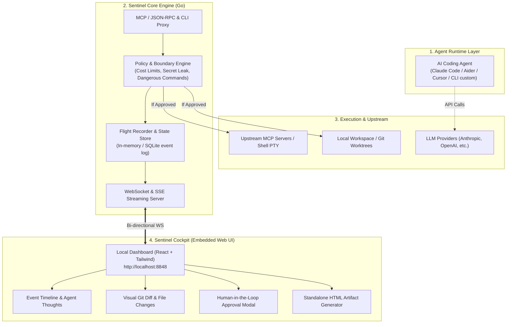

# Agent Sentinel: Architectural Blueprint & Product Specification

> **The Local-First Flight Recorder, Execution Boundary & Cockpit for AI Coding Agents**

---

## 1. Executive Summary & Product Vision

### 1.1 Il Problema nel Mercato (The Black Box Dilemma)
Oggi gli sviluppatori affidano sempre più compiti critici ad agenti autonomi da terminale (Claude Code, Aider, Codex CLI, agenti custom via MCP). Tuttavia, l'esperienza utente e l'affidabilità soffrono di tre problemi strutturali:

1. **Scatola Nera (Zero Visibilità):** Gli agenti agiscono all'interno del terminale producendo log caotici e stream testuali infiniti. È difficile comprendere la gerarchia di pensiero, la sequenza delle chiamate ai tool e la cronologia degli eventi.
2. **Rischio di Esecuzione & Costi Incontrollati:** Un loop infinito o un'istruzione mal interpretata può cancellare file sensibili, leakare secret (`.env`, token AWS) o consumare decine di dollari in token prima che lo sviluppatore riesca a premere `Ctrl+C`.
3. **Deliverable Dispersi:** Gli output intermedi (diagrammi di architettura Mermaid, benchmark di performance, report di analisi, diff di codice) restano sepolti nei buffer del terminale invece di diventare deliverable chiari, auditabili e condivisibili con il team.

### 1.2 La Soluzione: Agent Sentinel
**Agent Sentinel** è un binario ultra-leggero e distribuibile con zero dipendenze esterne che fa da **supervisore trasparente, proxy di protocollo e flight recorder** per qualsiasi agente AI.

* **Nessun lock-in:** Non richiede di riscrivere o modificare l'agente.
* **Local-First & Zero Config:** Funziona localmente sulla macchina dello sviluppatore senza richiedere server cloud terzi.
* **Human-in-the-Loop Nativo:** Consente all'uomo di intervenire visivamente quando l'agente sta per compiere un'azione rischiosa.

---

## 2. Target Personas & Use Cases

### Persona A: Il Solo Developer (Productivity & Peace of Mind)
* **Contesto:** Usa Claude Code o Aider quotidianamente per refactor e nuove feature.
* **Dolore:** Non si fida a lasciare l'agente lavorare da solo in background; ha paura che tocchi file fuori scopo o che sfori i budget API.
* **Valore di Sentinel:** Lancia l'agente con Sentinel in background. Ha una dashboard web su `localhost` che traccia i costi in tempo reale, mostra le modifiche con un diff visuale pulito e chiede approvazione con un click solo se l'agente prova a eseguire comandi pericolosi.

### Persona B: L'Engineering Lead / Reviewer (Audit & Collaboration)
* **Contesto:** Il team usa agenti AI per risolvere issue e aprire Pull Request.
* **Dolore:** I colleghi aprono PR generate da agenti senza spiegare il "perché" di certe scelte architetturali o quali tool/benchmark sono stati eseguiti.
* **Valore di Sentinel:** A fine sessione, Sentinel genera un file `audit-report.html` autonomo e graficamente impeccabile. Viene allegato alla PR come prova del ragionamento dell'agente, dei test eseguiti e del consumo di risorse.

### Persona C: Il SecOps / Security Conscious Engineer (Execution Boundary)
* **Contesto:** Lavora in aziende con policy stringenti su credenziali e codice proprietario.
* **Dolore:** Gli agenti LLM non devono mai accedere a cartelle esterne alla repository (`~/.ssh`, `~/.aws`), né leggere file contenenti secret.
* **Valore di Sentinel:** Sentinel agisce da **Boundary di Sicurezza**: blocca a monte le chiamate a tool o file vietati tramite policy preconfigurate.

---

## 3. Architettura di Sistema ad Alto Livello



---

## 4. Specifiche Tecniche dei Componenti Core

### 4.1 Interception Engine (MCP Proxy & Agent Hooks)
Il core engine supporta due modalità di intercettazione non invasiva:
1. **MCP Proxy Mode:** Si registra come server/middleware MCP. Quando l'agente esegue chiamate a tool (es. `execute_command`, `write_file`, `search_files`), la richiesta passa attraverso Sentinel via JSON-RPC 2.0.
2. **Agent Hooks Mode (Cursor, Claude Code):** l'agente stesso comunica a Sentinel ogni passo, tramite i suoi hook, e legge la decisione di Sentinel prima di eseguirlo. `sentinel hook` è il comando che l'agente lancia a ogni passo: inoltra il JSON a `sentinel serve` e restituisce la risposta nello schema dell'agente. Ogni agente ha il suo adattatore (`internal/cursorhooks`), che traduce gli eventi in chiamate `tools/call` e li passa allo stesso motore di policy, approvazioni e budget del proxy MCP.

   | | Cursor | Claude Code |
   | :--- | :--- | :--- |
   | Dove si installano | `.cursor/hooks.json` | `.claude/settings.local.json` (o `~/.claude/settings.json`) |
   | Prima del passo | `beforeShellExecution`, `beforeReadFile`, `beforeMCPExecution` | `PreToolUse` (ogni tool, anche le modifiche ai file) |
   | Dopo il passo | `afterShellExecution`, `afterFileEdit`, `afterMCPExecution` | `PostToolUse`, `PostToolUseFailure` |
   | Fine turno | `stop` | `Stop`, `SessionEnd` |
   | Modifica di un file | solo registrata dopo il fatto | giudicata e bloccabile prima |
   | Chiamata senza obiezioni | `permission: allow` | nessuna risposta, così valgono le regole di Claude Code (un `allow` esplicito salterebbe la sua richiesta di conferma) |
   | Sentinel non raggiungibile | `ask` | `ask` |

   Le chiamate che l'agente non chiude (comando saltato, rifiutato dall'utente nella conferma dell'agente o interrotto) restano "Running" finché non arriva `stop`/`Stop`/`SessionEnd`, che le chiude con lo stato `interrupted`. Questo stato non è un errore dello strumento: il cockpit lo mostra con un'icona propria, la barra delle metriche e il report lo contano a parte, e la sua durata non entra nelle latenze (mediana e p95). Un comando interrotto che l'agente stesso riporta come finito (Cursor manda l'evento "dopo" comunque) resta `ok`, perché Sentinel non ha modo di saperlo; Claude Code invece segnala `interrupted` nella risposta dello strumento e Sentinel lo registra.

Una modalità **PTY** (Sentinel lancia l'agente in uno pseudoterminale) era prevista in origine e non è più il piano: dal testo di un terminale non si ricavano in modo affidabile i singoli comandi, mentre gli hook li consegnano già strutturati. `sentinel run claude` sarà un avvio di Claude Code con gli hook di Sentinel attivi solo per quella sessione (`claude --settings`), non un PTY.

### 4.2 Policy & Guardrail Engine (Security Boundary)
Il motore di regole valuta ogni azione prima che venga inoltrata al sistema:
* **Livelli di Enforcing:**
  - `ALLOW`: Azione innocua (es. lettura file sorgente non sensibile). Inoltrata istantaneamente.
  - `WARN`: Azione potenzialmente impattante. Registrata nel log con flag di attenzione.
  - `REQUIRE_APPROVAL`: Azione a rischio (es. cancellazione file, script bash non convenzionali, comandi git distruttivi). Il proxy sospende la risposta dell'agente finché l'utente non clicca "Approva" nella UI.
  - `BLOCK`: Azione vietata categoricamente (es. accesso a chiavi SSH o `.env.production`). Chiamata respinta con messaggio di errore artificiale inoltrato all'agente.
* **Token & Budget Circuit Breaker:**
  - Stima dei token I/O e calcolo dinamico del costo stimato in USD per sessione.
  - Trigger automatico di pausa se il budget configurato (es. $2.50) viene superato.

### 4.3 Flight Recorder & Schema degli Eventi
Gli eventi registrati da Sentinel seguono uno schema canonico immutabile:

```json
{
  "session_id": "sess_01j7x9k2...",
  "timestamp": "2026-10-08T19:00:00Z",
  "sequence": 42,
  "type": "TOOL_CALL",
  "source": "claude-code",
  "payload": {
    "tool_name": "bash",
    "parameters": {
      "command": "git checkout -b refactor/auth"
    },
    "risk_level": "LOW",
    "status": "APPROVED",
    "duration_ms": 128
  }
}
```

### 4.4 The Cockpit (Local-First Web UI)
* **Single Binary Embedded:** Il frontend compilato (React + Tailwind) è impacchettato nel binario Go tramite `go:embed`. L'utente non deve configurare Node.js o porte speciali.
* **Real-time Live Stream:** Connessione WebSocket bidirezionale:
  - Invio continuo di eventi, log e variazioni dei file.
  - Invio di risposte di approvazione dall'interfaccia verso il motore Go.
* **Visual Diff Viewer:** Integrazione di un visualizzatore di diff (side-by-side e unified) con sintassi evidenziata per ispezionare le modifiche ai file prima dell'applicazione.

### 4.5 Standalone Report Generator (Deliverable Hub)
A fine sessione (o su comando `sentinel export`), il motore genera un singolo file HTML autonomo:
- Zero dipendenze esterne (CSS e JS inline).
- Diagrammi Mermaid renderizzati.
- Timeline interattiva espandibile.
- Metriche aggregate: tempo totale, token stimati, comandi eseguiti, file modificati.

---

## 5. Modalità d'Uso & CLI UX

```bash
# 1. Supervisionare Cursor o Claude Code tramite i loro hook
sentinel serve --open
sentinel hook install                  # Cursor: .cursor/hooks.json
sentinel hook install --agent claude   # Claude Code: .claude/settings.local.json

# (non ancora implementato) avviare Claude Code con gli hook attivi solo per quella sessione
# sentinel run claude

# 2. Avviare solo come proxy MCP per client come Cursor o Claude Desktop
sentinel mcp --port 8848

# 3. Aprire il cockpit web su una sessione passata
sentinel ui --session sess_01j7x9k2

# 4. Esportare il report standalone dell'ultima sessione
sentinel export --format html -o ./audit-report.html
```

---

## 6. Perché questo progetto è un differenziatore per il CV

| Aspetto Tradizionale dei Progetti Junior | Approccio di Agent Sentinel (Hiring-Ready) |
| :--- | :--- |
| Semplice wrapper di API OpenAI con prompt | Architettura di sistema complessa: proxying di rete, protocolli standard (MCP / JSON-RPC). |
| Codice monolitico in Python senza tipizzazione | Architettura modulare in **Go** con concorrenza reale (goroutines, canali, mutex). |
| Richiede setup complesso (Docker Compose, npm, python env) | **Zero-config single binary** con frontend incorporato via `go:embed`. |
| Solo un'interfaccia chat standard | Developer Tooling reale con diff viewer, timeline e circuit breakers di sicurezza. |
